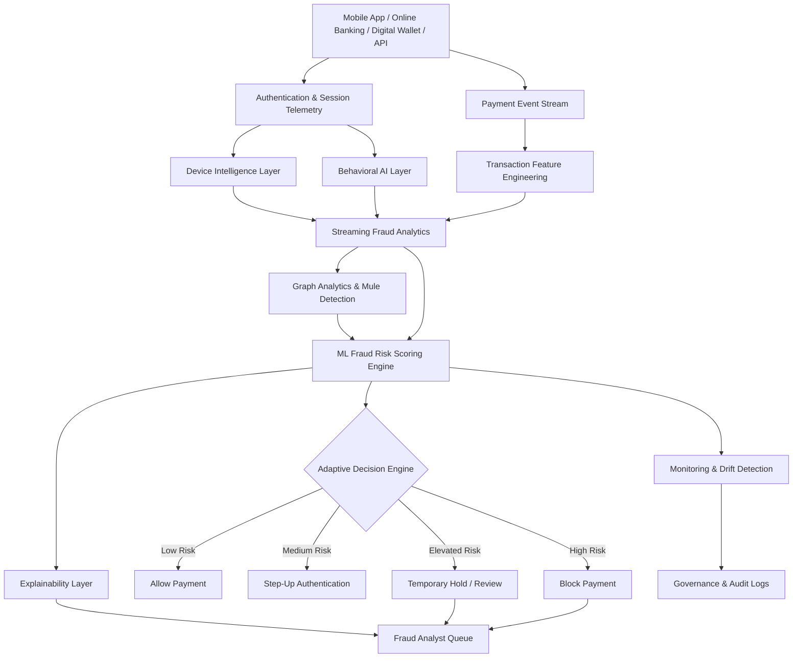

# Real-Time P2P Fraud Detection Architecture

## Architecture Description
The platform processes payment events, authentication signals, session telemetry, device intelligence, behavioral interactions, customer profiles, and graph relationship data in real time.

The transaction layer evaluates amount, velocity, recipient history, payment timing, and account behavior. Device intelligence evaluates IP reputation, proxy indicators, emulator signals, and device fingerprint consistency. Behavioral AI evaluates navigation flow, typing cadence, touch gestures, transaction hesitation, and abnormal session behavior.

Graph analytics models relationships among customers, accounts, devices, phone numbers, IP addresses, and recipients to identify mule networks, rapid fund dispersal, suspicious payment paths, and coordinated fraud rings.

The fraud risk scoring engine generates a probability score and reason codes. The adaptive decision engine allows low-risk payments, triggers step-up authentication, temporarily holds suspicious payments, or blocks high-risk transactions.
